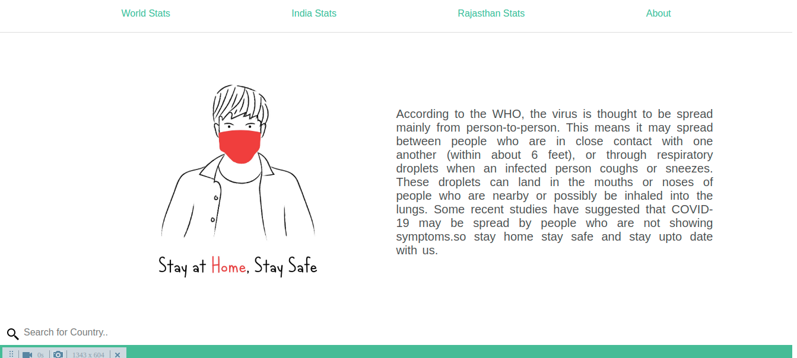

# covid-19-stat
 Live Corona Dashbord
 
responsive website

<table>
  <tr>
      <td> <h1>screenshot in pc </h1></td>
  </tr>
   <tr>
      <td></td>
  </tr>
  <tr>
      <td> <h1> corona cases in world country wise data. </h1></td>
  </tr>
  <tr>
      <td></td>
  </tr>
   <tr>
      <td> <h1> corona cases in india state wise data. </h1></td>
  </tr>
  <tr>
      <td></td>
  </tr>
   <tr>
      <td> <h1> corona cases in Rajasthan district wise data. </h1></td>
  </tr>
  <tr>
      <td></td>
  </tr>
   <tr>
      <td> <h1>  precaution or guidelines for coronavirus safety. </h1></td>
  </tr>
  <tr>
      <td></td>
  </tr>
  <tr>
      <td></td>
  </tr>
</table>
